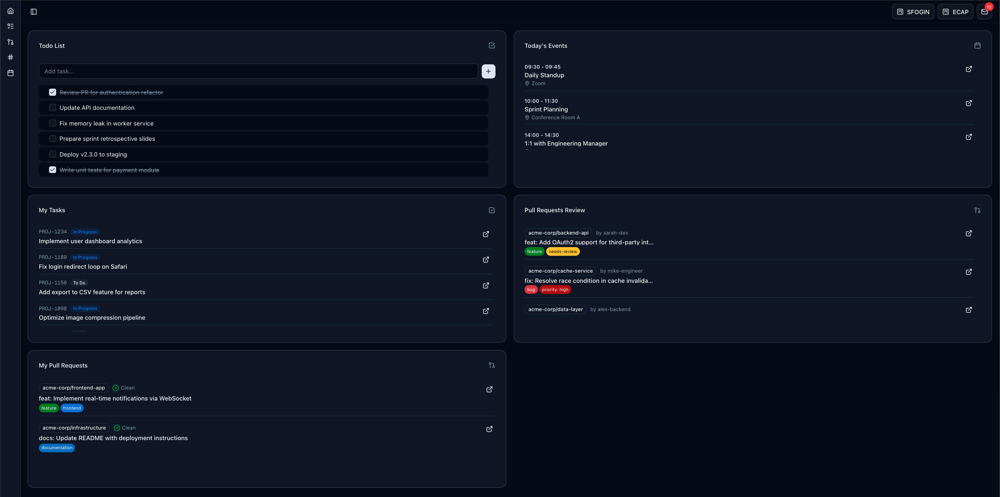

# AIN Dashboard

> **Your All-In-One Personal Command Center**




---

## What is AIN Dashboard?

**AIN Dashboard** is a **local-first, privacy-focused** productivity dashboard built for **developers and tech professionals**. It aggregates your daily work streams into a single, clean interface—no cloud services, no subscriptions, no data leaving your machine.

Instead of constantly switching between browser tabs for GitHub, Jira, Google Calendar, and your email, you get everything in one place. Clone it, configure your API tokens, and you're ready to go.

### Why use it?

- **🔒 100% Local** – Runs entirely on your machine via Docker. Your data stays yours.
- **⚡ Fast Setup** – One command to start the entire stack.
- **🎨 Developer-Friendly** – Dark theme, minimal UI, keyboard-friendly.
- **🔧 Fully Customizable** – Fork it, modify widgets, add integrations. It's your dashboard.

---

## Features

| Widget | Description |
|--------|-------------|
| **📝 Todo List** | Quick task management with drag-and-drop reordering |
| **🐙 GitHub PRs** | Pull Requests awaiting your review (personal + team requests) |
| **📦 My PRs** | Your open Pull Requests across all repositories |
| **🎫 Jira Tasks** | Your assigned tasks filtered by status (supports multiple Jira instances) |
| **📅 Calendar** | Today's events from Google Calendar |
| **✉️ Gmail** | Unread email count indicator |

---

## Tech Stack

| Layer | Technology |
|-------|------------|
| **Frontend** | [Next.js 16](https://nextjs.org/) (App Router), TypeScript, [Tailwind CSS](https://tailwindcss.com/), [shadcn/ui](https://ui.shadcn.com/) |
| **Backend** | [FastAPI](https://fastapi.tiangolo.com/) (Python), SQLAlchemy |
| **Database** | PostgreSQL |
| **Infrastructure** | Docker Compose |

---

## Quick Start

### Prerequisites

- [Docker](https://www.docker.com/) and Docker Compose
- Git

### Installation

```bash
# 1. Clone the repository
git clone https://github.com/yourusername/ain-dashboard.git
cd ain-dashboard

# 2. Copy environment template
cp .env.example .env

# 3. Start everything
docker compose up -d
```

**That's it!** Open [http://localhost:3001](http://localhost:3001) in your browser.

> **Note:** Without API tokens configured, widgets will show empty states. See [Configuration](#configuration) below to connect your services.

### Stopping the Dashboard

```bash
docker compose down
```

---

## Configuration

All configuration is done through environment variables in the `.env` file. Each integration is **optional**—configure only what you need.

### GitHub

Shows Pull Requests where your review is requested, including team review requests.

1. **Generate a token** at [GitHub Settings → Personal Access Tokens](https://github.com/settings/tokens)
   - Select scopes: `repo` and `read:org`
   
2. **For organization repos**: Click "Configure SSO" next to your token and authorize each organization

3. **Add to `.env`**:
   ```bash
   GITHUB_TOKEN=ghp_your_token_here
   ```

> ⚠️ Without SSO authorization, private org repositories won't be accessible.

---

### Jira

Shows tasks assigned to you, filtered by configurable statuses.

1. **Generate a token** at [Atlassian API Tokens](https://id.atlassian.com/manage-profile/security/api-tokens)

2. **Add to `.env`**:
   ```bash
   JIRA_DOMAINS=yourcompany.atlassian.net
   JIRA_EMAIL=your.email@company.com
   JIRA_API_TOKEN=your_api_token_here
   JIRA_TASK_STATUS_ENABLED="In Progress,To Do,Blocked"
   ```

**Multiple Jira instances** (same Atlassian account):
```bash
JIRA_DOMAINS=company1.atlassian.net,company2.atlassian.net
```

**Quick links** (optional sidebar shortcuts):
```bash
NEXT_PUBLIC_JIRA_LINKS='[{"name":"Sprint Board","url":"https://your-domain.atlassian.net/jira/..."}]'
```

---

### Google Calendar & Gmail

Shows today's calendar events and unread email count.

#### Step 1: Create OAuth Credentials

1. Go to [Google Cloud Console](https://console.cloud.google.com/)
2. Create a new project (e.g., "AIN Dashboard")
3. Enable **Google Calendar API** and **Gmail API** in *APIs & Services → Library*
4. Go to *APIs & Services → Credentials*:
   - Configure OAuth consent screen (External, add yourself as test user)
   - Create OAuth client ID (Desktop app type)
   - Download JSON → rename to `credentials.json`

5. Move the file:
   ```bash
   mv ~/Downloads/credentials.json ./backend/credentials.json
   ```

#### Step 2: Authorize

1. Start the dashboard: `docker compose up -d`
2. Open [http://localhost:3001](http://localhost:3001)
3. Click "Authorize Google Account" in the popup dialog
4. Complete the OAuth flow in your browser

A `token.json` file will be created automatically. When it expires, the dashboard will prompt you to re-authorize.

---

## Environment Variables Reference

| Variable | Required | Description |
|----------|:--------:|-------------|
| `NEXT_PUBLIC_API_URL` | ✅ | Backend URL (default: `http://localhost:8002`) |
| `DATABASE_URL` | ✅ | PostgreSQL connection string |
| `POSTGRES_USER` | ✅ | Database username |
| `POSTGRES_PASSWORD` | ✅ | Database password |
| `POSTGRES_DB` | ✅ | Database name |
| `GITHUB_TOKEN` | ❌ | GitHub Personal Access Token |
| `JIRA_DOMAINS` | ❌ | Jira domain(s), comma-separated |
| `JIRA_EMAIL` | ❌ | Atlassian account email |
| `JIRA_API_TOKEN` | ❌ | Atlassian API token |
| `JIRA_TASK_STATUS_ENABLED` | ❌ | Task statuses to display |
| `NEXT_PUBLIC_JIRA_LINKS` | ❌ | JSON array of quick link objects |
| `DEMO_MODE` | ❌ | Set to `true` for mock data (useful for screenshots) |

---

## Demo Mode

Want to see the dashboard with sample data? Enable demo mode:

```bash
# In your .env file
DEMO_MODE=true
```

Then restart:
```bash
docker compose restart backend
```

This displays realistic mock data without connecting to any external services—perfect for screenshots or demos.

---

## Project Structure

```
ain-dashboard/
├── frontend/          # Next.js application
│   ├── app/           # App router pages
│   ├── components/    # React components
│   │   ├── ui/        # shadcn/ui components
│   │   └── widgets/   # Dashboard widgets
│   └── hooks/         # Custom React hooks
├── backend/           # FastAPI application
│   ├── routers/       # API endpoints
│   ├── services/      # Business logic & external API calls
│   └── models.py      # Database models
├── docker-compose.yml # Container orchestration
└── .env.example       # Environment template
```

---

## Customization

This dashboard is meant to be **forked and customized**. Some ideas:

- **Add new widgets** – Create a new component in `frontend/components/widgets/`
- **New integrations** – Add services in `backend/services/` and expose via routers
- **Change the layout** – Modify the grid in `frontend/app/page.tsx`
- **Restyle** – Update `globals.css` or Tailwind config

---

## Development

For local development with hot reload:

```bash
# Backend changes require container restart
docker compose restart backend

# Frontend has hot reload enabled by default
# Just save your files and refresh the browser
```

**API Documentation**: [http://localhost:8002/docs](http://localhost:8002/docs) (Swagger UI)

---

## Contributing

Contributions are welcome! Feel free to:

1. Fork the repository
2. Create a feature branch (`git checkout -b feature/amazing-feature`)
3. Commit your changes (`git commit -m 'Add amazing feature'`)
4. Push to the branch (`git push origin feature/amazing-feature`)
5. Open a Pull Request

---

## License

MIT License. See [LICENSE](LICENSE) for details.

---

## Acknowledgments

Built with [Next.js](https://nextjs.org/), [FastAPI](https://fastapi.tiangolo.com/), [shadcn/ui](https://ui.shadcn.com/), and [Tailwind CSS](https://tailwindcss.com/).
